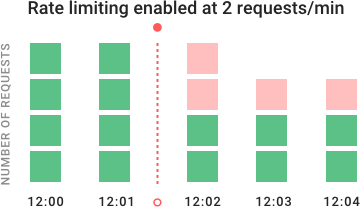

Network traffic tools for Erlang

License: Apache License 2.0


# Emqx Traffic Tools

## Introduction

This suit of tools aims to provide tools to control network traffic. It is still under development and token bucket algorithm has been finished now.

The chart below shows how token bucket algorithm works:



## Token Bucket Algorithm

**emqx_token_bucket** - Simple (token bucket) implementation which control network data flow by returning a time interval for user.

The Token Bucket Algorithm implemented in Emqx Traffic Tools not only supports network traffic in single process, but also supports to manage a pool of processes by using ets to record tokens.

**Example usage** (without ets):
``` erlang
%% BurstSize = 100(reqs or packets or messages)
%% LimitTokesn = 5 (Tokens to be consumed and added in token bucket)
%% Interval = 5 (specified interval time milliseconds)

TokenBucket = emqx_token_bucket:init_tokent_bucket(100, 5, 5),

{Pause, NewTokenBucket} = emqx_token_bucket:check_token_bucket(ConsumeData, TokenBucket).
%% 
```
The function `check_token_bucket` returns pause time which user should wait and a new token bucket state for next use. `ConsumeData` means the numbers of messages(packets or requests) per unit have to be transferred, it is not equal to the numbers of messages(packets or requests) which would be actually consumed or the tokens actually be taken.

If your application has a pool of processes and you want to limit the rate of the whole pool' messages or requests or packets. You can try emqx_token_bucket with ets.

**Example usage** (with ets):

``` erlang

TokenBucket = emqx_token_bucket:init_token_bucket(test, 100, 5, 5),
emqx_token_bucket:create_token_buckets(),
emqx_token_bucket:add_token_bucket(TokenBucket),

Pause = emqx_token_bucket:check_token_bucket_in_ets(ConsumeData, BucketName),
```

You can also get, update and delete the token bucket record in ets directly.

``` erlang
TokenBucket = emqx_token_bucket:info_token_bucket().
emqx_token_bucket:update_token_bucket(NewTokenBucket),
emqx_token_bucket:delete_token_bucket(test)
```

Notice: The name of token bucket must be atom type.

## Flapping Algorithm
**emqx_network_flapping** - Simple implementation which return a flapping state by checking the state transitions rate.

This algorithm is used to check to see if the state has started or stopped flapping. It does this by:

* Storing the results of the last few checks of the host or service
* Analyzing the historical check results and determine where state changes/transitions occur
* Using the state transitions to determine a percent state change value (a measure of change for the host or service)
* Comparing the percent state change value against low and high flapping thresholds


Definition of flapping_record 
``` erlang
-record(flapping_record, {
                          name                :: atom(),          % the name of flapping record
                          flapping_state      :: atom(),          % flapping state
                          check_times         :: pos_integer(),   % check times specified
                          time_interval       :: pos_integer(),   % time interval between each check(milliseconds)
                          high_flap_treshold  :: float(),         % high flapping treshold specified
                          low_flap_treshold   :: float()          % low  flapping treshold specified
                         }).
```

**Example usage** (without ets)

```erlang

FlappingRecord = emqx_network_flapping:init_flapping_record(test,30,1, 45/100, 30/100),
FlappingRecord1 = emqx_network_flapping:check_network_flapping_state(
                    fun check_state_high_flap/0,
                    check_state_high_flap(),
                    FlappingRecord),
FlappingState = FlappingRecord1#flapping_record.flapping_state.
```

**Example usage** (with ets)
```erlang
emqx_network_flapping:create_flapping_records(),
FlappingRecord = emqx_network_flapping:init_flapping_record(test, 30, 1, 45/100, 30/100),
emqx_network_flapping:add_flapping_record(FlappingRecord),
emqx_network_flapping:check_network_flapping_record(fun check_state_high_flap/0,
                                                    check_state_high_flap(),
                                                    test),
FlappingRecord1 = emqx_network_flapping:info_flapping_record(test),
FlappingState = FlappingRecord1#flapping_record.flapping_state.
```

You can also get, update and delete the flapping records in ets directly.

```erlang
FlappingRecord1 = emqx_network_flapping:info_flapping_record(test),
emqx_network_flapping:add_flapping_record(FlappingRecord),
emqx_network_flapping:update_flapping_record(NextFlappingRecord).
```

Notice: The name of flapping record must be atom type.
